**Lichess Blitz Prediction Model Final Report**

By: Tia Zheng, Rebecca Geisberg, Kai Solter

1. **How to build and run our code**
- First clone our repo onto your local machine
- Next navigate to it in the terminal and type “make run”
- This should print our accuracy from the random forest model into your console! The model.py file simply tests our model. If you want to look more comprehensively at our process, please navigate to the final.ipynb
2. **Introduction**

   Over the years, AI has become a powerful tool across industries, transforming fields from financial analysis to medical breakthroughs. While much of AI's power has gone toward serious advancements, we decided to explore a lighter application: predicting outcomes in Lichess Blitz chess games using machine learning. This technology enables computers to identify complex patterns in data and make informed predictions—perfect for analyzing the intricate dynamics of chess.

   In chess, player ratings—a numerical score reflecting skill based on past wins and losses—typically make game outcomes easy to predict, especially when there’s a large rating gap. However, we wanted to see if a model could reveal more subtle factors that might affect the result, such as the color of the pieces each player controls, recent performance trends, and etc. Our goal is to uncover scenarios where a lower-rated player might triumph over a higher-rated opponent, or determine the outcome in matches between similarly rated competitors.

   By analyzing these nuances, we hope to add a new layer of insight into chess outcomes in online play, looking beyond basic ratings to understand the deeper dynamics of competitive online Blitz chess.

3. **Data Collection**

  Our data sample contains a set of users from distinct lichess rating sub-brackets, overall ranging from around 550 to 2750, as the minimum rating on the platform is 400 and the max is 2900. To build this dataset, we manually pick users that fall in the median of each 150-point rating sub-bracket, a choice driven by our data collection method. Specifically, our approach involves repeatedly retrieving each user’s past 15 opponents recursively, 

  adding these players to the user\_id list. We continued until reaching a list of approximately 18,000 unique user\_ids. Once we established this user base, we looped through the list of user\_ids to obtain each user's Blitz rating from the Lichess API. Focusing on Blitz-style gameplay, we used this list to retrieve additional game-related features from each user's recent Blitz games.

  These features include:

  1. **Blitz Rating** (blitz\_rating): The user’s current rating in Blitz.
  2. **Total Blitz Games Played** (blitz\_total\_games): The all-time number of Blitz games played by the user on Lichess.
  3. **Game Count** (game\_count): The number of Blitz games each user had played within their most recent 300 games, capped at 100 Blitz games per user. For users with fewer than 100 Blitz games (out of the recent 300), win, draw, and loss rates are calculated based on the total games available. To ensure data accuracy in reflecting current skill and activity, we excluded users who hadn’t played any Blitz games within their last 300 games.
  4. **Color Specific Game Count** (white\_game\_count, black\_game\_count): The number of Blitz games that each user has played within their 300 recent games capped at 110 games (total for white and black) so capped at an average of 55 per color. To ensure data accuracy we excluded users who had 0 games as either color.
  5. **Rating Deviation** (rating\_deviation): Measures how accurately a user’s rating reflects their current skill level. Lower value means the rating is more stable. Above 110, the rating is considered provisional. To be included in the rankings, this value should be below 75 (standard chess).
  6. **Win, Draw, and Loss Rates –Based on total Game Count** (win\_rate, draw\_rate, lose\_rate): Rates that reflect the user’s overall performance across their recent Blitz games, using the total number of Blitz games retrieved (up to a maximum of 100) from most recent 300 games as a basis. This gives a general view of the user's success, independent of color.
  7. **Win, Draw, and Loss Rates –Based on color played from color based Game Count** (black\_win\_rate,black\_lose\_rate,black\_draw\_rate): Rates further broken down based on the color of pieces the user played (white or black) within the same recent Blitz games. This provides insights into any potential differences in performance when playing as white versus black.
  8. **Top, Second ECO** (op\_top\_eco,  op\_second\_eco, user\_top\_eco, user\_top\_eco): These features represent the most frequently played, and second most frequently played opening by the user/opponent. Note, this feature is different from the opening that has the highest number of wins for the user. 
  9. **Top, Second Win Rate Eco** ( user\_top\_winrate\_eco, user\_second\_winrate\_eco, op\_top\_winrate\_eco, op\_second\_winrate\_eco): These features represent the opening that has the highest number of wins for the user/opponent, and the second highest number of wins for the user/opponent. Note, this feature is different from the most frequently played opening.
  10. **Mate, Resign, Time, Win and Loss Rate** ( these are ways you can ) (user\_mate\_winrate, user\_resign\_winrate, user\_time\_winrate, user\_mate\_lossrate, user\_resign\_lossrate, user\_time\_lossrate, op\_mate\_winrate, op\_resign\_winrate, op\_time\_winrate, op\_mate\_lossrate, op\_resign\_lossrate, op\_time\_lossrate): These features represent the different ways you can win or lose the chess game: Checkmate, resign, or timeout (time). Therefore each of these features is as a percentage of all of the user’s wins/losses out of the past 110 blitz games that ended in the specified result. For example op\_mate\_lossrate is the percentage of the opponents lost games which ended in checkmate. user\_time\_winrate is the percentage of the user’s game which they won and ended in checkmate, etc. 
  11. **Average Game Length (**user\_average\_game\_len, op\_average\_game\_len): This feature is simply the average game length of the past 110 blitz games of the user or the opponent respectively
  12. **Best Win 1, 2, and 3** (op\_best\_win\_1, op\_best\_win\_2, op\_best\_win\_3, user\_best\_win\_1, user\_best\_win\_2, user\_best\_win\_3): The ratings of the highest, second-highest, and third-highest rated opponents the user has defeated. If the user has not defeated anyone who’s rating is sufficiently higher, this data does not exist.
  13. **Game Result (**game\_result**):** This feature represents who ended up winning the game. This field contains a 1 if the user won, a -1 if the opponent won and a 0 if the game concludes in a draw (neither player won).

   It should be noted that our data has the above features for both the user and their opponent (designated as user\_<feature> or op\_<feature>). *Specifically*, the csv used by the models contains the user id and the above features for the user, and then the opponent id and the features for the opponent, then finally the result of their head to head match.

4. **Preliminary Data Analysis** 

   To begin with, we got a preliminary rating distribution of our users and opponents as shown below (2 graphs):

   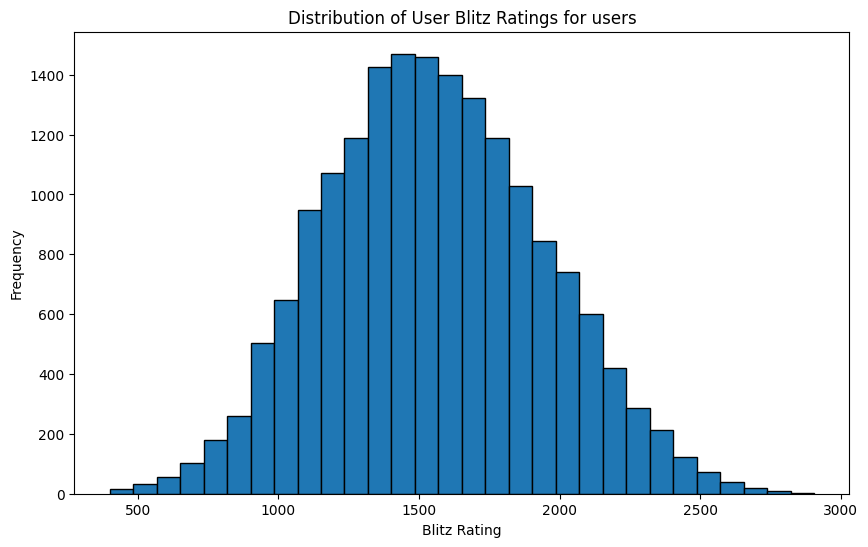
   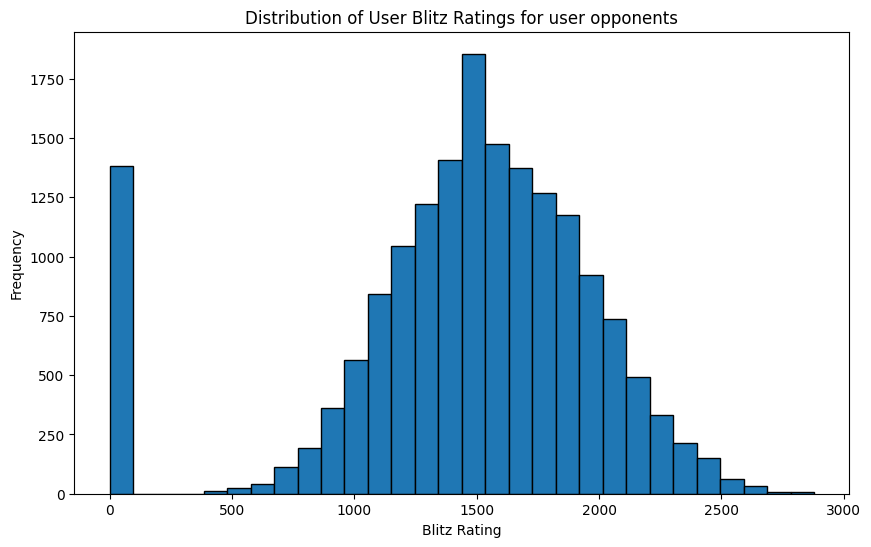

   This should be matched to follow the same rating distribution of active blitz users on lichess:

   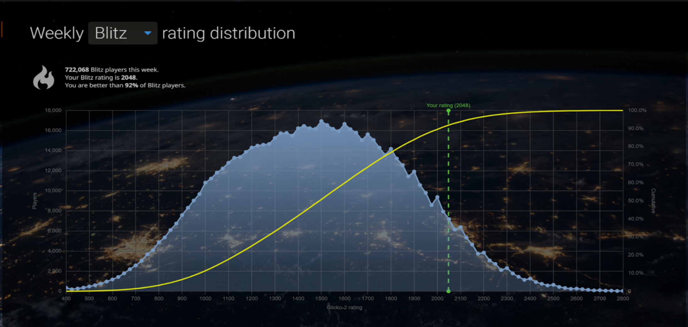

   Distribution of blitz rating for users and opponents of our dataset after basic cleaning (2 graphs): 

   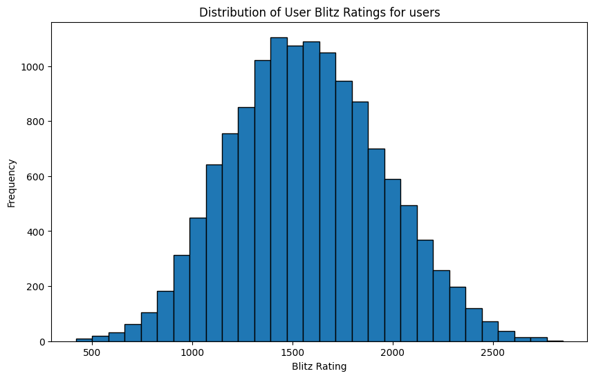  
   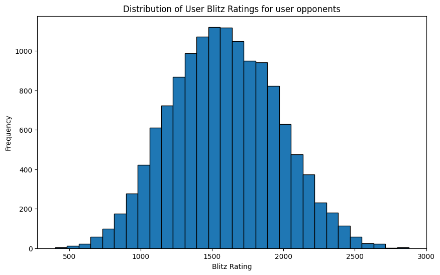

   Distribution of working rating deviation for users and opponents (2 graphs): Distribution of Win rates for users and opponents:

   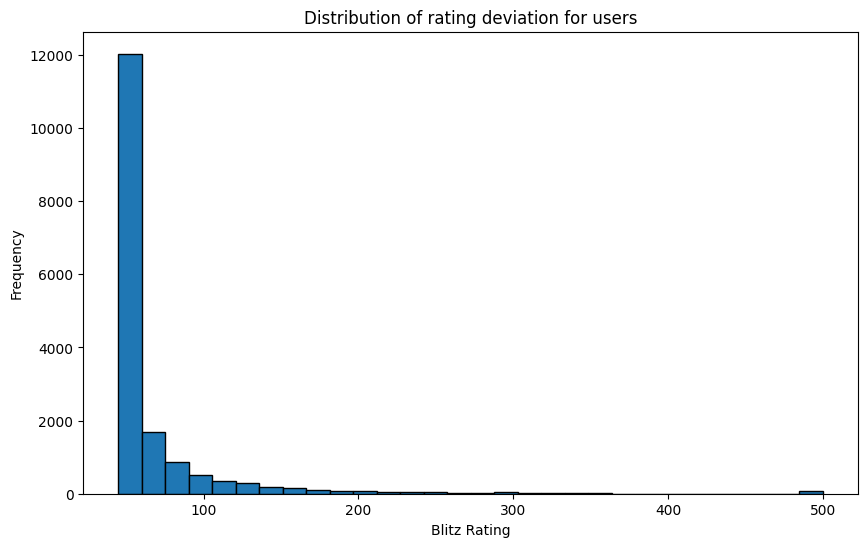
   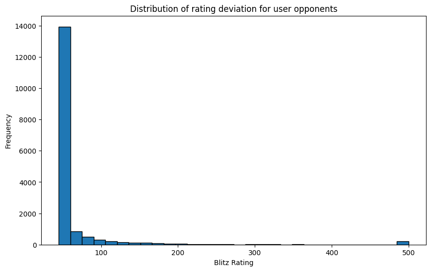

   Distribution of White user win rates and Black opponent win rates to represent distribution of overall win rates:

   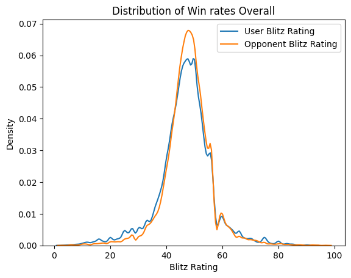
   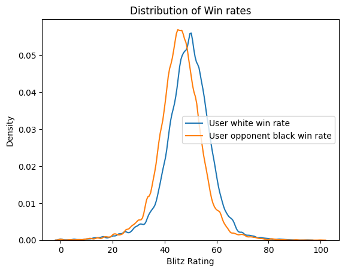

   Distribution of draw rates when user is White and opponent is Black: 

   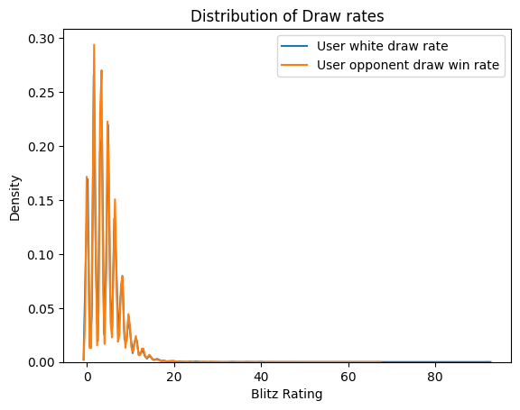
   
   Graph visualizing the loss trends across players of different ratings: 
   
   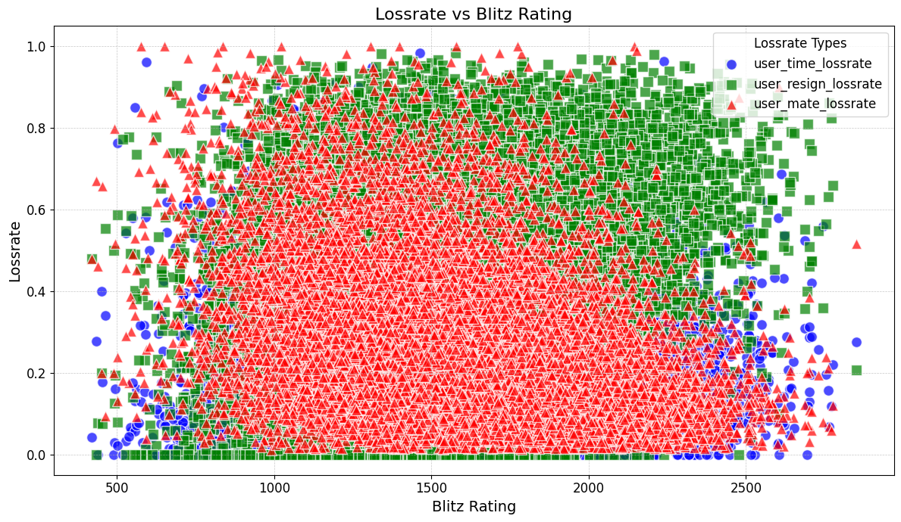
   
   Visualization of rating differences between the user and their opponents:

   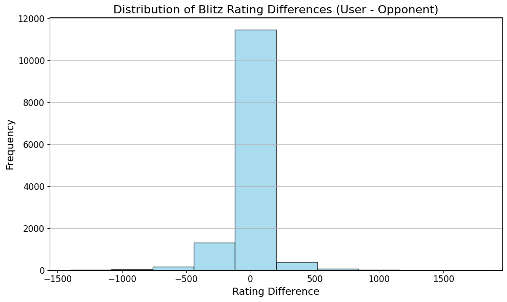

5. **Data Preparation**

   The first step in our preprocessing was to cut our user rating distribution to match the real rating distribution provided by lichess, our data collection method did not quite match the real population distribution so we adjusted accordingly.

   The second step in our preprocessing is to remove or convert non categorical variables into numerical ones. First we begin by simply dropping the names of the users. Next we use label encoding (which we found to work better than one-hot encoding) for the ECO data which is non numerical.

   Next we removed irrelevant users based on our preliminary analysis. We decided to remove users that had played less than a total of 10 games, in order to ensure that the features were relevant to the user.  Additionally, we removed users with zero games as white, or zero games as black. As our scripts were fetching data from the lichess api, they sometimes failed to receive good data from a request and ended up zeroing out these columns. In order to clean our data and ensure every number represents real information about a user we dropped these rows. We check all of the features which might be zeroed out separately for data cleaning, as there could be, for example, a user with a total game count above 10, but zeroed out color specific features, and this methodology prevents that user from skewing the predictions. Finally we also removed users which had NaN in any feature as they simply represent a more obvious error with the API requests.

   **Correlation Matrix on selected features:** Absolute Correlation with Label

**rating\_diff:**  0.190107 **op\_performance:**  0.151073 **user\_performace:** 0.147513 **user\_white\_performance:**  0.131743 **op\_black\_performance:** 0.130451 **op\_white\_performance:** 0.127312 **user\_black\_performance:** 0.125836 **best\_win\_diff:**  0.057021 **op\_resign\_perf:**  0.056709 **user\_lose\_len:**  0.038115 **op\_time\_performance:** 0.037267 **op\_time\_winrate:** 0.030332 **user\_resign\_perf:**  0.026505 **combined\_draw4:** 0.025300 **op\_average\_best\_win:** 0.023714 **op\_mate\_perf:**  0.023683 **game\_count\_ratio:** 0.023570 **deviation\_compare:**  0.020500 **user\_average\_best\_win:** 0.016920 **user\_time\_winrate:** 0.012298 **op\_rating\_deviation:** 0.012261 **user\_rating\_deviation:** 0.010859 **op\_lose\_len:** 0.009984 **compare\_len:**  0.009055 **user\_time\_performance:** 0.008953 **user\_mate\_perf:**  0.000607

6. **Feature Engineering**

   Once we finished cleaning our data, it was time to engineer some custom features to better represent the differences between our user and opponent. Our main focus was to capture new meaningful relationships between the user and their opponent's playing ability that were not originally captured with the collected features. Additionally, in order to avoid confusing/overwhelming the models with excessive features, we combined several features into one feature that would be fed into the model instead.  Listed below are  the various features which we created. In trying to determine if they were useful to the model, many of these features did not end up being useful in our final modeling approach. 

- **Average Best Win** (average\_best\_win) 
  - This** feature represents the average of the best wins for the user and op respectively
- **Best Average Win Difference** (best\_average\_win\_diff)
  - This feature represents the difference between the users average best win and the ops average best win
- **Best Win Difference** (best\_win\_diff)
  - This feature represents the difference between the users best win and the ops best win
- **User top eco in op top winrate eco** (user\_eco\_in\_op\_winrate)
  - This feature represents if the users top eco is in the ops top winrate eco, implying that the op is successful against this opening (and vice versa)
- **White performance** (white\_performance)
  - This feature represents the user's white win-rate multiplied by the op's black lose-rate. This feature gives insight into the given match if the user is white and the op is black, the higher this number the more favorable it is for the user. 
- **Black performance** (black\_performance)
  - This feature represents the users black win-rate multiplied by the ops black lose-rate, using the same logic as White\_performance
- **High draw rate** (high\_draw\_rate)
  - This feature represents if both the user and op have a draw rate above five percent. This threshold was chosen because this is an above average draw rate percentage overall.
- **Draw rate** (draw\_rate)
- This feature represents the user draw rate plus the op draw rate 
- **Combined draw rate** (combined\_draw4) 
  - This feature represents the sum of the user white draw rate, the op white draw rate, the user black draw rate, and the op black draw rate (the 4 represents the 4 original features it was pulled from)
- **Time performance** (time\_performance)
  - This features represents the user time win rate multiplied by the op time loss rate and vice versa
- **Performance** (performance)
  - This feature represents the user win rate multiplied by the op loss rate and vice versa
- **Rating difference** (rating\_diff)
  - This feature represents the difference between the user blitz rating and op blitz rating (user rating - op rating) 
- **Resign performance** (resign\_perf)
  - This features represents the user resign win rate multiplied by the op resign loss rate and vice versa
- **Mate performance** (mate\_perf)
  - This features represents the user mate win rate multiplied by the op mate loss rate and vice versa
- **Game count ratio** (game\_count\_ratio)
  - This feature represents the user game count divided by the op game count
- **Deviation comparison** (deviation\_compare)
  - This feature represents the user rating deviation divided by the op rating deviation
- **Game length comparison** (compare\_len)
  - This feature represents the user average game length divided by the opponent average game length
- **Lose length** (lose\_len)
- This feature represents the user time loss rate divided by the opponent average game length and vice versa
7. **Feature Selection**

   After creating an abundance of engineered features, we then needed to choose which features, engineered or collected, are relevant for our model. In order to do this we first looked at the correlation which each feature had without the target feature (game\_result). Based on those results, we chose a preliminary list of features which had high correlation. From there, we refined our selection through simple trial and error where we added and removed features one at a time (updating hyper parameters accordingly) and determined which features made the model better/worse. The features which we settled on for our final model are listed below: 

   Selected features:

- **Time winrate** (time\_winrate)
  - One of our collected features which we found to be meaningful in predicting the result during trial and error
- **Rating deviation** (rating\_deviation)
  - Another of our collected features which we found to be useful in trial and error
- **Average Best Win** (average\_best\_win) 
  - An engineered feature which we found to be useful in trial and error
- **Best Win Difference** (best\_win\_diff)
  - An engineered feature which has a high correlation with the target feature
- **Lose length** (lose\_len)
  - An engineered feature which despite actually having a low correlation with the target was found to be useful through trial and error
- **Performance** (performance)
  - An engineered feature which has very high correlation with the target
- **White performance** (white\_performance)
  - An engineered feature which has very high correlation with the target
- **Black performance** (black\_performance)
  - An engineered feature which has very high correlation with the target
- **Time performance** (time\_performance)
  - An engineered feature which despite actually having a low correlation with the target was found to be useful through trial and error
- **Rating difference** (rating\_diff)
  - An engineered feature which has very high correlation with the target
- **Resign performance** (resign\_performance)
  - An engineered feature which has a reasonably high correlation with the target
- **Game count ratio** (game\_count\_ratio)
  - An engineered feature which despite actually having a low correlation with the target was found to be useful through trial and error
- **Mate performance** (mate\_perf)
  - An engineered feature which despite actually having a low correlation with the target was found to be useful through trial and error
- **Deviation comparison** (deviation\_compare)
- An engineered feature which has a reasonably high correlation with the target
- **Game length comparison** (compare\_len)
- An engineered feature which despite actually having a low correlation with the target was found to be useful through trial and error
8. **Model Selection**

   Our model will be predicting a categorical outcome, as the results of a chess game can only be a win, a loss, or a draw. That is, we are trying to solve a trinary classification problem.

   We tried four different models, K Nearest Neighbors (KNN), Random Forest, Neural Network (Sequential), and Extreme Gradient Boosting (XGBoost). We used a grid search for hyperparameter tuning on each model. We eventually settled on the random forest model as it had the most accurate and consistent performance. 

   K Nearest Neighbors, or KNN, is a model which classifies a data point by organizing its test data in an Nth dimensional space (where N is the number of features), and then choosing the K nearest neighbors on the graph of the new datapoint which it is attempting to predict. Then the model determines of the K points it is checking which class the majority of them are sorted into, and chooses that class for the new datapoint. This model is simple to implement and can work well for smaller datasets. However KNN is very easily disrupted by noise, and struggles with high dimensional data. Since our dataset has many features KNN was not an optimal choice. (Its best accuracy was about 0.572).

   Extreme Gradient Boosting or XGBoost is a model which creates optimized gradient boosted trees. The model iteratively builds up these trees correcting from previous data and using regularization as well as other techniques to avoid overfitting. XGBoost is fast and efficient to train, and performs well even with missing data. Some drawbacks of XGBoost are that it can easily overfit and requires careful hyperparameter tuning. XGBoost was a close second and performed almost as well as Random Forest for our data, however we ultimately chose to not use it. We already handle missing data in our preprocessing so that particular benefit of XGBoost was not relevant to us. Our results with XGBoost and Random Forest were very similar and we ultimately could have chosen either model but ended up choosing Random Forest due to its relative simplicity. (Its best accuracy was about 0.588).

   Neural Networks are a machine learning model which creates interconnected layers of ‘neurons’ as follows: The input layer, which has  a neuron to represent each feature. The hidden layer(s) which have different numbers of neurons per layer in addition to a variable number of layers depending on the problem. Finally, the output layer which contains a neuron for each potential class of output from the target feature. The neurons from one layer to the next are connected with weights and biases, and the model incrementally improves each iteration with backpropagation and gradient descent. For our model, we used 3 hidden layers of 128, 62 and 32 neurons. Neural Networks are good at finding non linear relationships and can easily scale to large datasets. However they perform worse on smaller datasets as they need lots of data to determine good weights.  Neural Networks also have the  risk of overfitting. Our dataset after cleaning has 14k rows, and therefore our Neural Network  approaches struggled to form good predictions. In light of this, we discarded the Neural Network approach. (Its best accuracy was 0.5858).

   Finally the model which we ended up selecting is Random Forest, as it performed the best for our specific requirements. The random forest model creates a collection (forest) of decision trees, which are each trained on a sample of data, then the final prediction is a majority vote of the trees. This model does well for classification tasks and is robust to noise (which we found very helpful). Some weaknesses of the random forest model include that it can be slow to train and struggles with spare data. We had a lot of noise in our data and training time was not a major issue, so we ultimately found that this model performed the best. We got an accuracy of 0.594 with Random Forest.

   NOTE: Discrepancies across systems may result in slightly different prediction accuracy outputs.

9. **Reflection**

  When reflection upon this project, there are several lessons we learned along the way: 

  1. RATE LIMITING ISSUES
    1.When we were collecting our data, the main issue we ran into was rate limiting with the Lichess API. When we were trying to get our initial user id list, we were requesting data too fast, which was really halting our progress. However, we ended up changing our code so that when we run into rate limiting issues, we save our progress into a csv, and pick up from where we left off. Even with this system in place, the rate limiting was a significant challenge in terms of timely data collection. It's possible that we should have emailed the creator of the lichess API in hopes that he would be receptive to the idea of sharing data with us. However, we were nervous about being locked out of the API all-together (although we did ensure that we were following the user guidelines). Upon reflection, all things considered we would email first, and go from there. 

  2. PROGRESS/CHANGES SINCE MIDTERM REPORT
   1. Since the midterm report, several things in our project have changed. For starters, a feature that we used in the midterm called current\_win\_streak, was actually cheating. This feature was cheating because it held the current number of games that the user had won in a row, which inadvertently gives away the answer of who won the game. One of the users would have a nonzero positive value as their win streak, and the other would have a zero.  
   2. Another advancement since our midterm is the new features we engineered. Most if not all of the engineered features were developed post midterm, because we did some serious data cleaning. We took a hard look at our final csv from the midterm, and made sure that all of the data was good. Once we were happy with our users and ops, we were able to engineer features more efficiently. Additionally, post midterm we finally had all of the features that we derived strictly through the API, which took months due to rate limiting. Certain features like user\_best\_win and time win/draw/loss rate we didn't fully have until after the midterm. 
   3. We also have a semi-functional website that fetches user and op stats in real time from an input box, and can use the model to predict who would win in the head to head match. Unfortunately, we were unable to finish it before the deadline but will complete it and push it to our github in the near future. It only had feature fetching capabilities, and the API endpoint that we tried to create for the model still needed debugging. This is why we created the python notebook and python script, to demonstrate our model in a simple way. 
  3. CONCLUSION 
   1. Our accuracy since the midterm dropped down to .594, however this is not indicative of our current data and model being worse than what we had for the midterm. Instead, this is a direct result of removing the current\_win\_streak feature, which had inadvertent access to the target feature and therefore improved accuracy massively. After taking this into account, the real accuracy (without cheating) which we achieved in the midterm was significantly lower and our new data and model outperforms it by around 4%. 
   2. In conclusion, we managed to follow through on our midterm goal of getting better features. This significantly helped us improve our model. We would have liked to achieve a higher accuracy, such as potentially .65 or .7, which we believe would be possible with additional time dedicated to data collection, feature selection and hyperparameter tuning, and finally  a larger dataset with more features. That being said, we are proud to have created this dataset *entirely* from scratch, which allowed us to achieve an accuracy that is far superior to simple guesswork!
   3. Finally, some next steps to improve this project would be to collect a larger dataset (in order to utilize neural network models which generally need more training data) and to further engineer features. One specific example of this is the ECO (opening) data. Although we managed to collect data about user’s opening preferences and performances, we were unable to engineer any useful features out of this data. Another potential area of improvement would be to spend more time closely determining which model with which parameters is best for our set. In particular, the structure of a neural network’s hidden layer is one area where we would like to experiment.

**10.  Sources**

**Lichess.org.** *Lichess API Documentation*. Lichess.org, https://lichess.org/api. Accessed 5 Nov. 2024.
